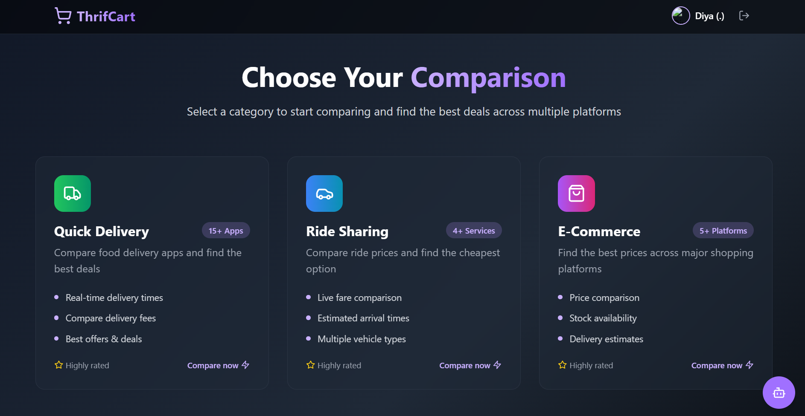
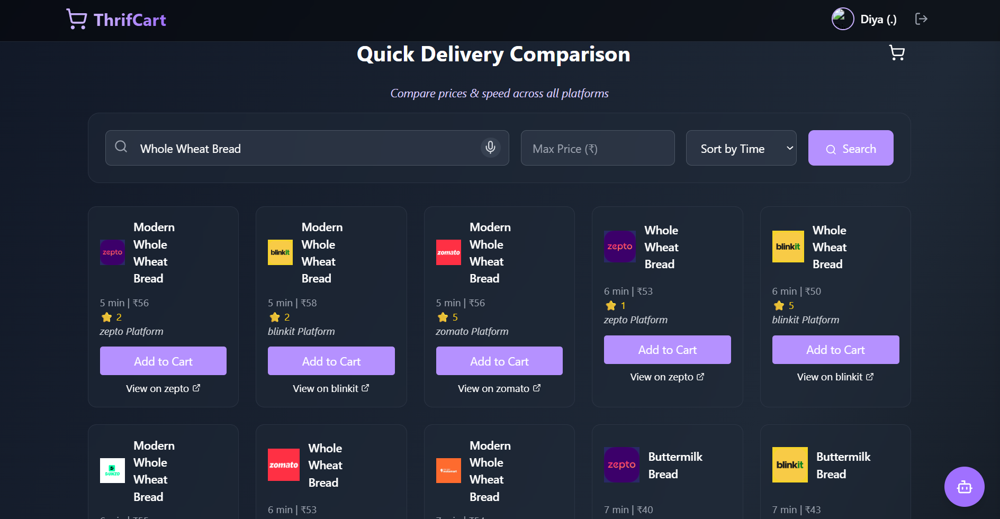
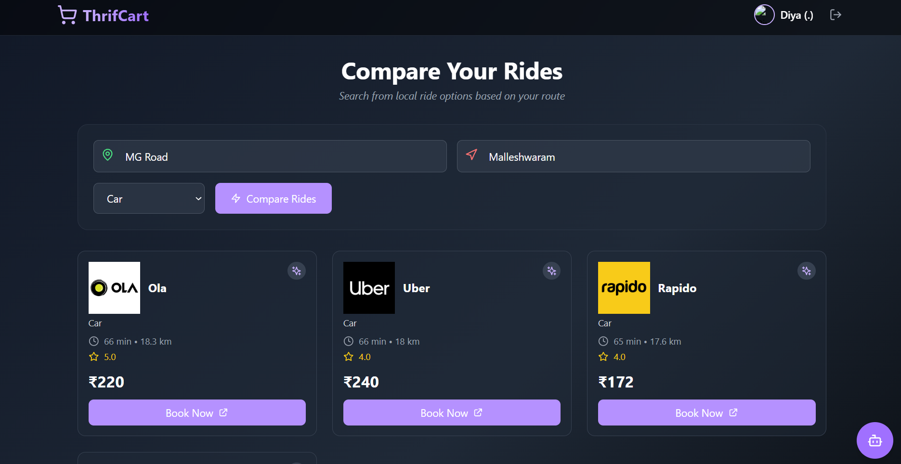
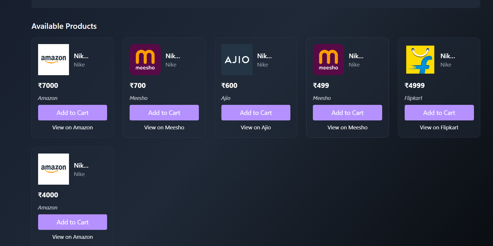
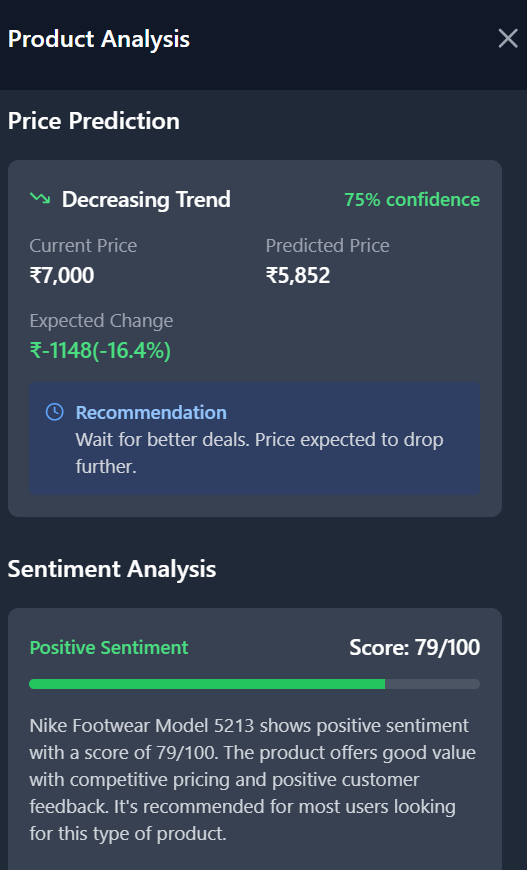
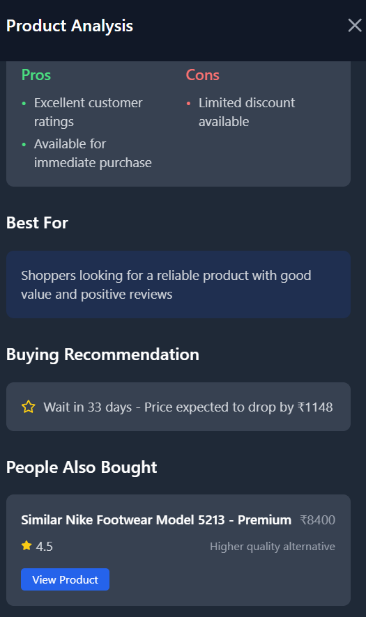

# 🛒 ThrifCart

> **Smart shopping companion powered by AI** — personalized deals, price predictions, and savings insights across India's top platforms.


---

## 📌 About ThrifCart

ThrifCart is a full-stack AI-powered shopping assistant that helps users in India save money across multiple platforms — groceries, rides, and e-commerce. It uses machine learning models (KNN, ARIMA, XGBoost, LightGBM) to analyze spending patterns, predict prices, and deliver personalized recommendations.

---

## ✨ Features

- 🤖 **AI-Powered Recommendations** — Personalized product and deal suggestions using KNN & collaborative filtering
- 📈 **Price Prediction** — ARIMA & XGBoost models forecast price trends across platforms
- 🛍️ **Multi-Platform Support** — Covers Blinkit, Zomato, Swiggy, Zepto, Ola, Uber, Myntra, Flipkart, Amazon & more
- 💬 **Sentiment Analysis** — NLP-powered review analysis using DistilBERT
- 📊 **Spending Insights** — Visual dashboards showing savings and spending patterns
- 🗺️ **Interactive Maps** — Location-based deal discovery using React Leaflet
- 🔔 **Smart Alerts** — Notifications for price drops and flash deals

---

## 🏗️ Tech Stack

### Frontend
| Technology | Purpose |
|---|---|
| React 18 + Vite | UI framework & build tool |
| React Router v7 | Client-side routing |
| React Leaflet | Interactive maps |
| Tailwind CSS | Styling |
| React Toastify | Notifications |

### Backend / ML
| Technology | Purpose |
|---|---|
| Flask | REST API server |
| Pandas + NumPy | Data processing |
| Scikit-learn | KNN & ML models |
| XGBoost + LightGBM | Price prediction |
| ARIMA (statsmodels) | Time series forecasting |
| Transformers (DistilBERT) | Sentiment analysis |
| NLTK | Natural language processing |

---

## 📁 Project Structure

```
ThrifCart/
├── project/
│   ├── src/                    # React frontend source
│   │   ├── components/         # Reusable UI components
│   │   ├── pages/              # Route pages
│   │   └── assets/             # Static assets
│   ├── thriftcartmodel/        # Python ML backend
│   │   ├── data/
│   │   │   └── raw/            # Raw user data (JSON)
│   │   ├── models/             # Trained ML models
│   │   ├── services/           # Business logic
│   │   ├── utils/              # Helper functions
│   │   ├── tests/              # Unit tests
│   │   ├── app.py              # Flask entry point
│   │   ├── config.py           # Configuration
│   │   └── requirements.txt    # Python dependencies
│   ├── package.json
│   └── vite.config.ts
```

---

## 🚀 Getting Started

### Prerequisites
- Node.js v18+
- Python 3.10+
- Git

---

### 1. Clone the Repository

```bash
git clone https://github.com/shreyabn12/thrifbolt.git
cd thrifbolt
```

---

### 2. Frontend Setup

```bash
cd project
npm install --legacy-peer-deps
```

Create a `.env` file in the `project` folder:
```env
VITE_API_URL=http://localhost:5000
```

Start the frontend:
```bash
npm run dev
```

Frontend runs at → **http://localhost:5173**

---

### 3. Backend Setup

```bash
cd project/thriftcartmodel

# Create virtual environment
python -m venv venv

# Activate (Windows)
venv\Scripts\activate

# Activate (Mac/Linux)
source venv/bin/activate

# Install dependencies
pip install -r requirements.txt
```

Start the Flask server:
```bash
python app.py
```

Backend runs at → **http://localhost:5000**

---

## 🔧 Environment Variables

Create a `.env` file inside `project/thriftcartmodel/`:

```env
DEBUG=False
SECRET_KEY=your-secret-key-here
```

---

## 🤖 ML Models Used

| Model | Use Case |
|---|---|
| KNN (K-Nearest Neighbors) | User-based recommendations |
| ARIMA | Price trend forecasting |
| XGBoost | Deal scoring & ranking |
| LightGBM | Fast purchase prediction |
| CatBoost | Categorical feature handling |
| DistilBERT | Review sentiment analysis |

---

## 🛒 Supported Platforms

| Category | Platforms |
|---|---|
| 🛒 Grocery | Blinkit, Zomato, Swiggy, Dunzo, Zepto, BigBasket, JioMart |
| 🚗 Rides | Ola, Uber, Namma Yatri, Rapido |
| 👗 E-commerce | Myntra, AJIO, Flipkart, Meesho, Amazon |

---

## 📸 Screenshots

### Home Page


### Quick Delivery Comparision


### Ride Comparision


### E-Commerce Comparision


### Price trend prediction, recommendation and Analysis - Part 1


### Price trend prediction, recommendation and Analysis - Part 2


---

## 🧪 Running Tests

```bash
cd project/thriftcartmodel
pytest tests/
```

---

## 🚢 Deployment

### Frontend (Vercel)
```bash
cd project
npm run build
# Deploy the dist/ folder to Vercel
```

### Backend (Render / Railway)
- Set Python version to 3.13
- Set start command to: `python app.py`
- Add environment variables from `.env`

---

## 🤝 Contributing

1. Fork the repository
2. Create a feature branch: `git checkout -b feature/amazing-feature`
3. Commit your changes: `git commit -m "Add amazing feature"`
4. Push to branch: `git push origin feature/amazing-feature`
5. Open a Pull Request


---

## 👩‍💻 Author

**ThrifCart Team**
- GitHub: [@shreyabn12](https://github.com/shreyabn12)

---

<p align="center">Made with ❤️ in India 🇮🇳</p>
